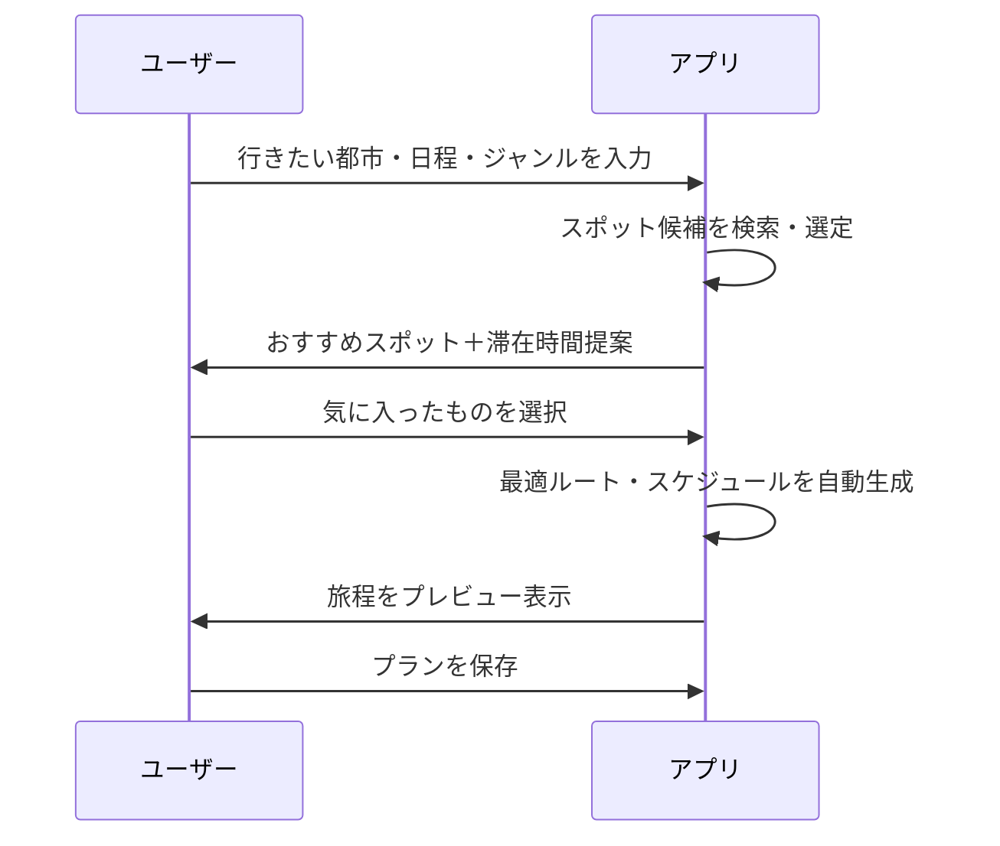

なるほど、ありがとうございます！😊
「特に不満はない」ってことは──

🧠 今あるサービスでもそれなりに満足してるけど、
✨ このアプリが実現すれば「もっとスムーズに、自分好みの旅がプランニングできそう！」っていうポテンシャルを感じてるのかもしれませんね！

それでは──
ここまでの情報を元に、**あなたがこのアプリを使うシーン**をストーリーで描いてみますね👇

---

## 🎭 ユーザーストーリー

> ユーザー「来月、ヨーロッパに旅行行くから、そろそろ計画立てようかな」
>
> ユーザー「この“旅プランAI（仮）”ってアプリ、良さそうかも」
>
> アプリ「こんにちは！今回はどこへ旅行しますか？」
> ユーザー「パリとローマ」
>
> アプリ「好きなジャンルを教えてください」
> ユーザー「歴史スポットとカフェ巡り！」
>
> アプリ「滞在時間をしっかり楽しみたい派ですか？それともサクサク回りたい派ですか？」
> ユーザー「しっかり楽しみたい派！」
>
> アプリ「了解です！では以下のスポットを提案します」
> ✅ パリ歴史博物館（1時間半）
> ✅ ノートルダム大聖堂（45分）
> ✅ モンマルトルのカフェ（1時間）
>
> ユーザー「わー、いい感じ！時間配分もちょうどいい」
>
> アプリ「では、これを1日目の旅程として保存しますね。他の日も作りますか？」
> ユーザー「お願いします！」

---

## ✅ 要件定義

### 📱 必要な機能一覧（ユーザー向け）

| 機能名        | 概要                    |
| ---------- | --------------------- |
| プラン作成ウィザード | 行きたい国・都市・日程を入力して開始    |
| 興味ジャンル設定   | 歴史・グルメ・絶景などテーマを選択     |
| 自動ルート生成    | 入力スポットをもとに、移動順・時間を最適化 |
| 時間配分設定     | 各スポットに滞在時間を設定・自動調整可能  |
| プラン保存・編集   | 作成したプランを保存・日ごとに編集可能   |
| PDFエクスポート  | 作成した旅程をPDFなどでエクスポート   |

### ⚙️ テーブル構造（例）

| テーブル名           | カラム名                                               | 内容               |
| --------------- | -------------------------------------------------- | ---------------- |
| users           | id, name, email, password\_digest                  | ユーザー基本情報         |
| trips           | id, user\_id, title, start\_date, end\_date        | 各旅行の基本情報         |
| interests       | id, name                                           | 興味ジャンル（歴史、グルメなど） |
| destinations    | id, trip\_id, name, stay\_duration\_minutes, order | 各旅行内の訪問先情報       |
| trip\_interests | trip\_id, interest\_id                             | 多対多の中間テーブル       |

---

### 🔁 シーケンス図（mermaid記法）

---

「なんか、これ見てたら本当に旅に行きたくなってきたな〜！」って気分になってたら、成功です😆笑
この仕様を元に開発を進めることもできますし、さらに機能を肉付けすることもできます！

ほかに追加したいアイデアや「ここをもう少し変えたい！」という点があれば、ぜひ教えてくださいね！✍️
